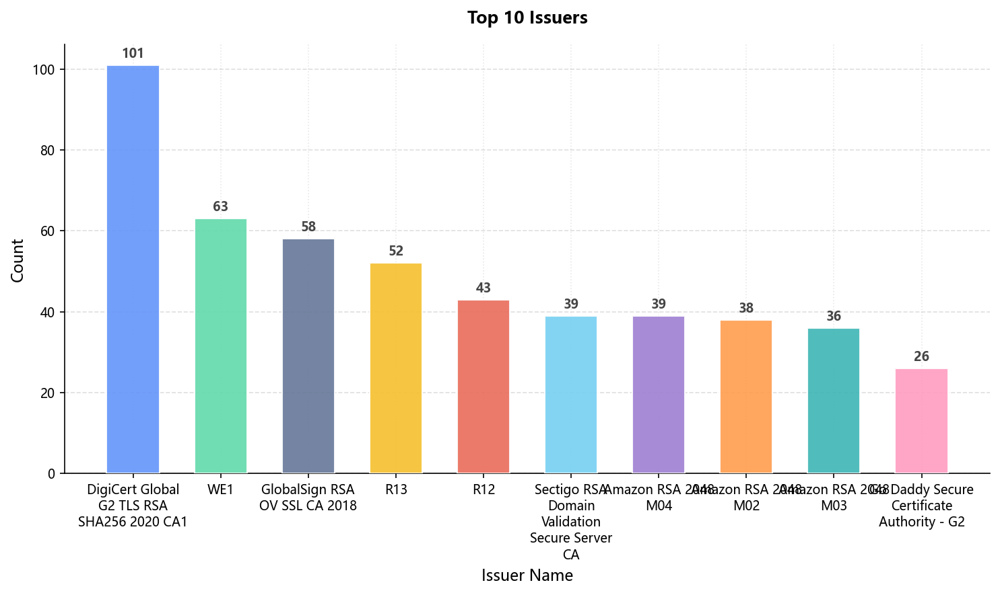
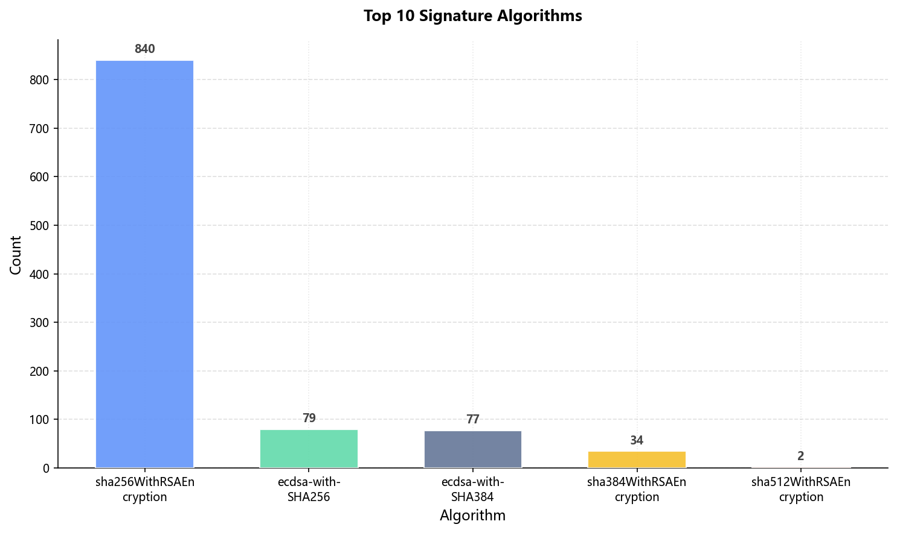
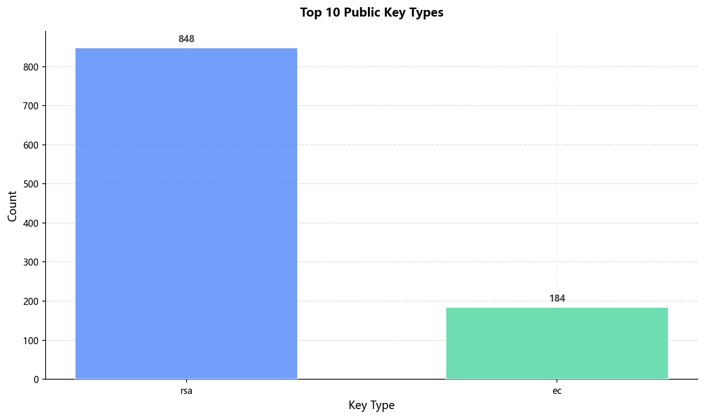
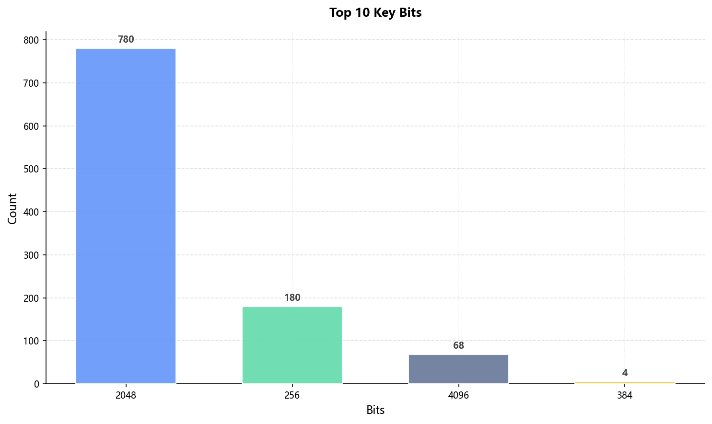
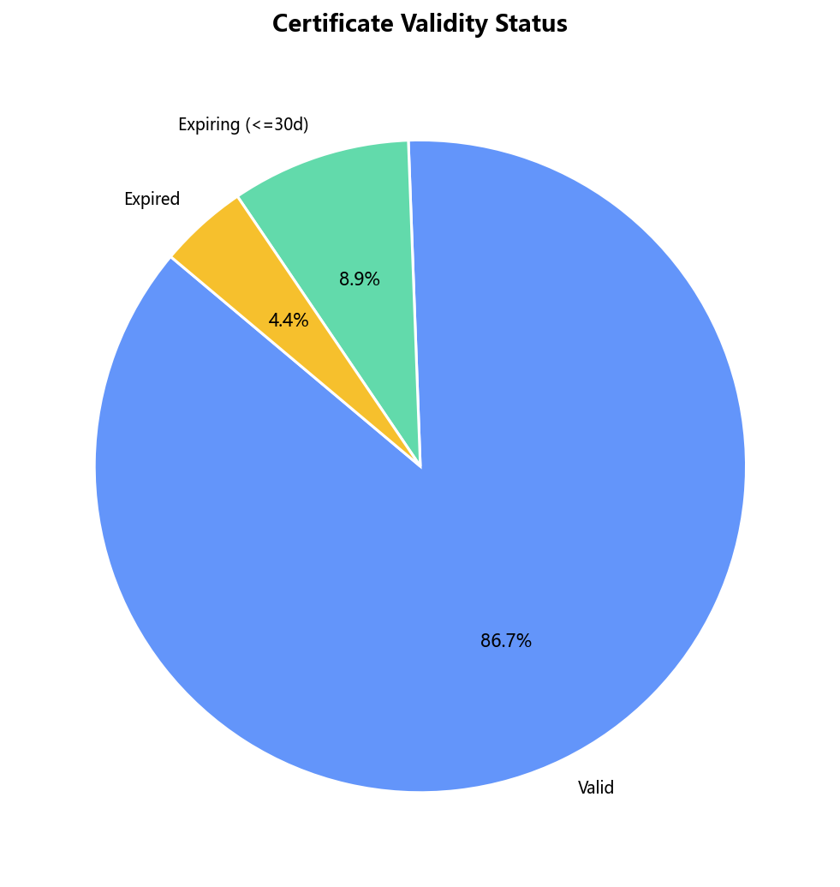

# Analyzing SSL/TLS certificates used by real web sites

**Generated**: 2025-11-23 22:18:24

## Major steps:

### • Create a tool or use existing tool to scan 1K HTTPs web sites and collect their certificates.
- **Total Scanned Hosts (Nmap)**: 1032
- **Valid Certificates Parsed**: 1025

### • Use existing security search engine to collect more certificates.
- **External Source**: crt.sh (or similar)
- **External Records Added**: 3333
- **Total Unique Certificates (Merged)**: 4365

### • Analyze the hosts sending back the certificates
- **Certificate Reuse**: Analyzed via SHA-256 fingerprint.
- **Top Shared Cert**: `18fece093913d57220eb6bb1391876...` (Used by **1** IPs)
- Full list: `results/lists/cert_reuse_top50.csv`

### • Analyze the properties of certificates
> **Dataset used for charts**: balanced (Total: 1135)
**Top Issuers**
- DigiCert Global G2 TLS RSA SHA256 2020 CA1：101
- WE1：63
- GlobalSign RSA OV SSL CA 2018：58
- R13：52
- R12：43
- Sectigo RSA Domain Validation Secure Server CA：39
- Amazon RSA 2048 M04：39
- Amazon RSA 2048 M02：38
- Amazon RSA 2048 M03：36
- Go Daddy Secure Certificate Authority - G2：26

**Signature Algorithms**
- sha256WithRSAEncryption：840
- ecdsa-with-SHA256：79
- ecdsa-with-SHA384：77
- sha384WithRSAEncryption：34
- sha512WithRSAEncryption：2

**Public Key Types**
- rsa：848
- ec：184

**Key Bits**
- 2048：780
- 256：180
- 4096：68
- 384：4

**Validity Status**

### • Measure the certification revocation of web sites.
- **Sample Size**: 1000
- **Good**: 765 (76.5%)
- **Revoked**: 0 (0.0%)
- **Unknown/Error**: 235 (23.5%)
- Raw results: `results/lists/revocation_sample_result.csv`
